## ANSIBLE CONFIGURATION MANAGEMENT – AUTOMATE PROJECT 7 TO 10

Projects 7 - 10 involved performing a lot of manual operations to set up virtual servers, install and configure required software, deploy your web application

This project will allow you automate these manual tasks using Ansible Configuration Management. 

### Ansible Client as a Jump Server (Bastion Host)
A `Jump Server` or `Bastion Host` is an intermediary server through which access to internal network can be provided. In our architechture so far, we have been accessing the webservers directly. In real life, webservers ideally will be inside a secured network which cannot be reached directly from the internet. This means that DevOps engieers cannot `SSH` directly into the webservers and can only access it through a `Jump Server` This provides better sercurity and reduces `attack surface`

On the diagram below the Virtual Private Network (VPC) is divided into two subnets – Public subnet has public IP addresses and Private subnet is only reachable by private IP addresses.

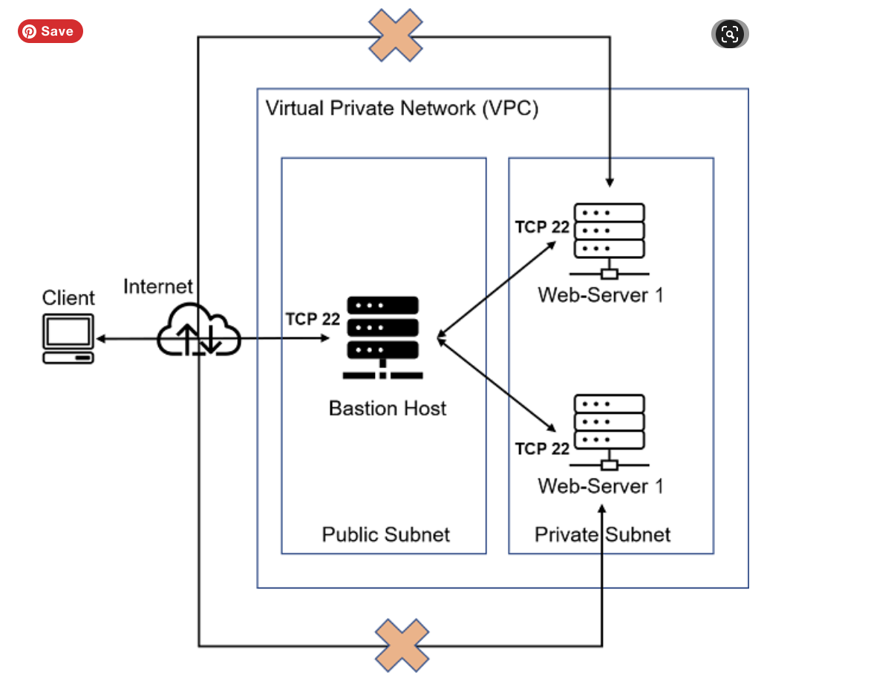

### Task
- Install and configure Ansible client to act as a Jump Server/Bastion Host
- Create a simple Ansible playbook to automate servers configuration

(Ensure VSCode is installed with `Remote development` extension also installed. This helps to ssh into remote servers and open folders on remote folders also)

## INSTALL AND CONFIGURE ANSIBLE ON EC2 INSTANCE

1. Update Name tag on your Jenkins EC2 Instance to `Jenkins-Ansible`. We will use this server to run playbooks. SSH into this Jenkins server instance
2. In your GitHub account create a new repository and name it `ansible-config-mgt`.
3. Instal Ansible with the code below:

`sudo apt update`

`sudo apt install ansible`

Check your Ansible version by running `ansible --version`

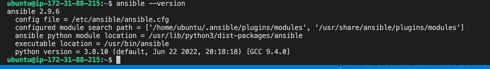

4. Configure Jenkins build job to save your repository content every time you change it – this will solidify your Jenkins configuration skills acquired in Project 9. Do this with the following steps:

- Create a new Freestyle project `ansible` in Jenkins and point it to your `ansible-config-mgt` repository. (Access Jenkins from browser using the public ip address with :8080. Also note that you are using the https address of your github repository and not the ssh address)
- Configure Webhook in GitHub and set webhook to trigger ansible build. Ensure to always update the public IP address of the webhook everytime you restart the instance as the public IP address changes. 
- Configure a Post-build job to save all (**) files, like you did it in Project 9.

5. Test your setup by making some change in README.MD file in master branch and make sure that builds starts automatically and Jenkins saves the files (build artifacts) in following folder

`ls /var/lib/jenkins/jobs/ansible/builds/<build_number>/archive/`

Runing the above code (using sudo) and checking contents of the README.md files shows below the samll change that was made to the readme.md file and this triggered an automatic build/run on jenkins witn artifcats saved

Note: Trigger Jenkins project execution only for /main (master) branch. You will have to change it from `master` to `main` on the jenkins source code management console. 

Now your setup will look like this:

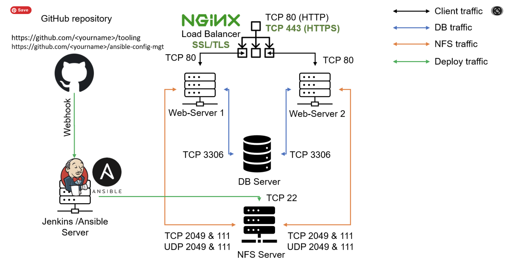

Tip: Every time you stop/start your Jenkins-Ansible server – you have to reconfigure GitHub webhook to a new IP address, in order to avoid it, it makes sense to allocate an Elastic IP to your Jenkins-Ansible server (you have done it before to your LB server in Project 10). Note that Elastic IP is free only when it is being allocated to an EC2 Instance, so do not forget to release Elastic IP once you terminate your EC2 Instance.

## Step 2 – Prepare your development environment using Visual Studio Code

1. First part of ‘DevOps’ is ‘Dev’, which means you will require to write some codes and you shall have proper tools that will make your coding and debugging comfortable – you need an `Integrated development environment (IDE)` or `Source-code Editor`. There is a plethora of different IDEs and Source-code Editors for different languages with their own advantages and drawbacks, you can choose whichever you are comfortable with, but we recommend one free and universal editor that will fully satisfy your needs – `Visual Studio Code (VSC)`

2. After you have successfully installed VSC, configure it to connect to your newly created GitHub repository.

3. Clone down your ansible-config-mgt repo to your Jenkins-Ansible instance

`git clone <ansible-config-mgt repo link>`

Run this acutal code in the command line of your Jenkins-Ansible terminal:

`git clone https://github.com/tolaadisa/ansible_config_mgt.git`

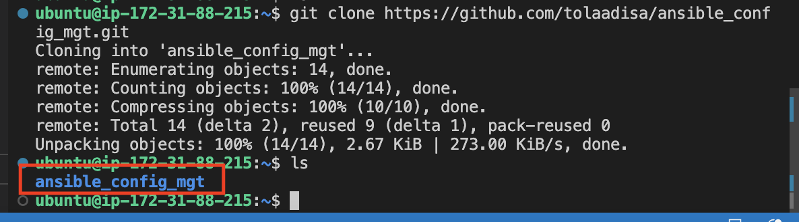

Another way of doing the above clone is for you to use the `clone repository` button which you have on VS code after you have installed the extensions at the begging of this project. Paste the link for the repository to be cloned and then open a terminal. 

## BEGIN ANSIBLE DEVELOPMENT

Firstly you need to check that you are working in the main branch of the `ansible-config-mgmt` repository within the VS Code environment. Do this check by typing the command:

`git branch`

The result below verifies I am working in the main branch:

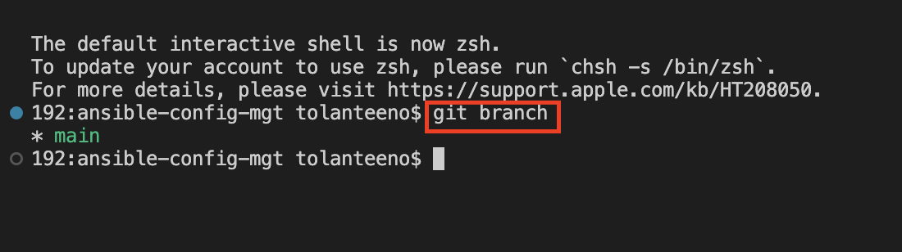

1. In your ansible-config-mgt GitHub repository, create a new branch that will be used for development of a new feature.

Tip: Give your branches descriptive and comprehensive names, for example, if you use Jira or Trello as a project management tool – include ticket number (e.g. `PRJ-145`) in the name of your branch and add a topic and a brief description what this branch is about – `a bugfix`, `hotfix`, `feature`, `release` (e.g. `feature/prj-145-lvm`)

To create this new branch, use the code below:

`git checkout -b prj-11`

This code means to create a new branch called `prj-11`

Then check the `git branch` to see that you are in the newly created branch per below:

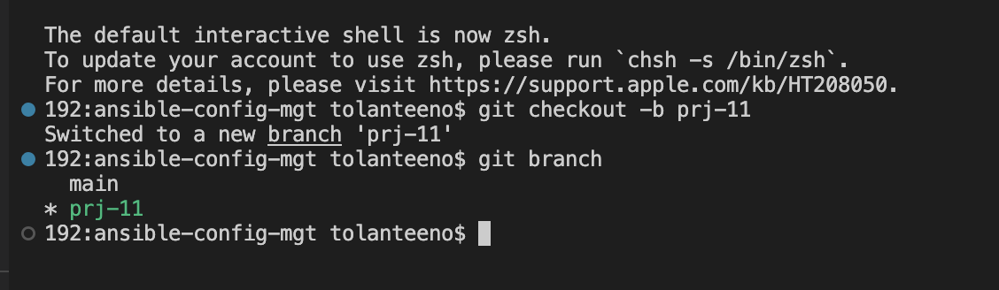

2. Checkout the newly created feature branch to your local machine and start building your code and directory structure

3. Create a directory and name it `playbooks` – it will be used to store all your playbook files.

use the code `mkdir playbooks`

4. Create a directory and name it `inventory` – it will be used to keep your hosts organised.

use the code `mkdir inventory`

Below is a snapshot of above two directories that were created

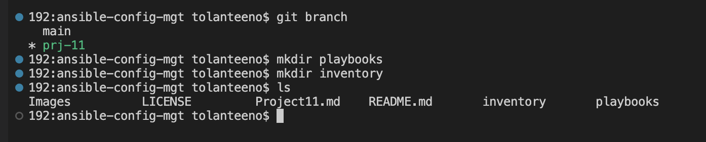

5. Within the playbooks folder, create your first playbook, and name it `common.yml`

First change directory into playbooks folder before running the code:

`touch common.yml`

6. Within the inventory folder, create an inventory file (.yml) for each environment (Development, Staging Testing and Production) `dev`, `staging`, `uat`, and `prod` respectively.

cd back to the main level of the repository and then change the directory to the inventory folder. Within this folder you run the following commands:

`touch dev.yml`
`touch staging.yml`
`touch uat.yml`
`touch prod.yml`

Below is a snapshot of the newly created files above:

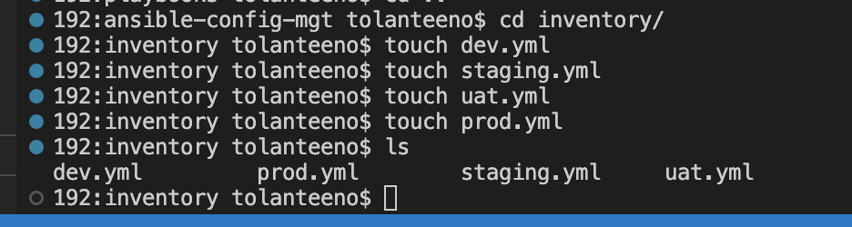

### Step 4 – Set up an Ansible Inventory
An Ansible inventory file defines the hosts and groups of hosts upon which commands, modules, and tasks in a playbook operate. Since our intention is to execute Linux commands on remote hosts, and ensure that it is the intended configuration on a particular server that occurs. It is important to have a way to organize our hosts in such an Inventory.

Save below inventory structure in the `inventory/dev` file to start configuring your development servers. Ensure to replace the IP addresses according to your own setup.

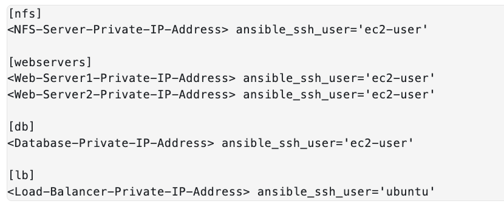

Ensure you verify the usernames to use for each of these servers in the inventory file is correct. For redhat servers, username is `ec2-user` for ubuntu servers, the username is `ubuntu`

Note: Ansible uses TCP port 22 by default, which means it needs to `ssh` into target servers from `Jenkins-Ansible` host – for this you can implement the concept of `ssh-agent`. Now you need to import your key into ssh-agent:

### step 4B

Navigate via command line to the folder in which the .pem file used to connect to the Jenkins-Ansible instance is stored and then run the first code of the two in below snapshot

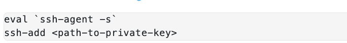

The result of running the first command is below:

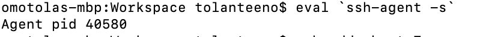

In the same folder/directory location, run the second line of code. The actual code run is below:

`ssh-add ubuntu7.pem`

Below shows confirmation that the pem key has been added

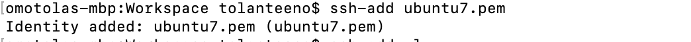

Confirm the key has been added with the command below, you should see the name of your key

`ssh-add -l`
Below shows the result which is the actual pem key:

Now, ssh into your Jenkins-Ansible server using ssh-agent (use the same terminal that you used to configure the previous step of `ssh-add`)

`ssh -A ubuntu@public-ip`

The actual code run is below and this is followed by confrimation that a connection has been made to the Jenkins-Ansible EC2 instance:

`ssh -A ubuntu@44.201.161.165`

Note that the public ip address changes everytime you restart the instance

Also notice, that your Load Balancer user is `ubuntu` and user for RHEL-based servers is `ec2-user`.

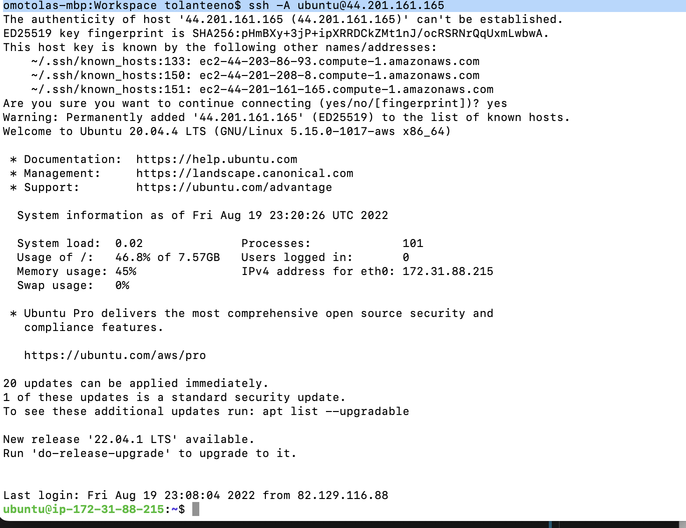

Ensure the pem key persists on the server by running the code below whilstl inside the Jenkins-Ansible server after making the connection using pem key:

`ssh-add -l`

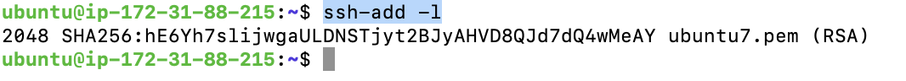

This connection means that any server that is created using the same pem key that was added can be connected to from the Jenkins-Ansible instance. 

Now go back to your vscode environment and Update your `inventory/dev.yml` file with this snippet of code:

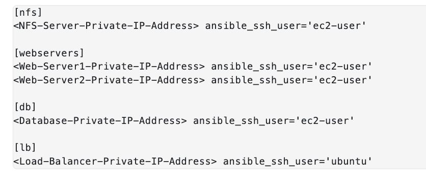

Ensure to use the correct private IP address of the NFS and 2 Webservers, DB server and load balancer instances. Also ensure that the correct users for each instance is selected. 

The `ansible_ssh_user` is needed to let ansible know which username to use for connecting with each host. 

### Add SSH agent for the other servers to be connected to Bation/Jenkins-Ansible server (start from step 4B above)

Now repeat above step `4b` to add the .pem keys of the NFS, Webservers, LB and every other server that you expect the bastion host to connect to.

Once you have done this, you need to confirm that you can connect/ssh into these other servers from the bastion/jenkins-ansible server. To connect, use the code below for ubuntu servers:

`ssh ubuntu@<private-ip-address>`

Then use the code below for the redhat servers:

`ssh ec2-user@<private-ip-address>`

## CREATE A COMMON PLAYBOOK

### Step 5 – Create a Common Playbook
It is time to start giving Ansible the instructions on what you needs to be performed on all servers listed in `inventory/dev`.

In `common.yml` playbook you will write configuration for repeatable, re-usable, and multi-machine tasks that is common to systems within the infrastructure.

Update your `playbooks/common.yml` file with following code:

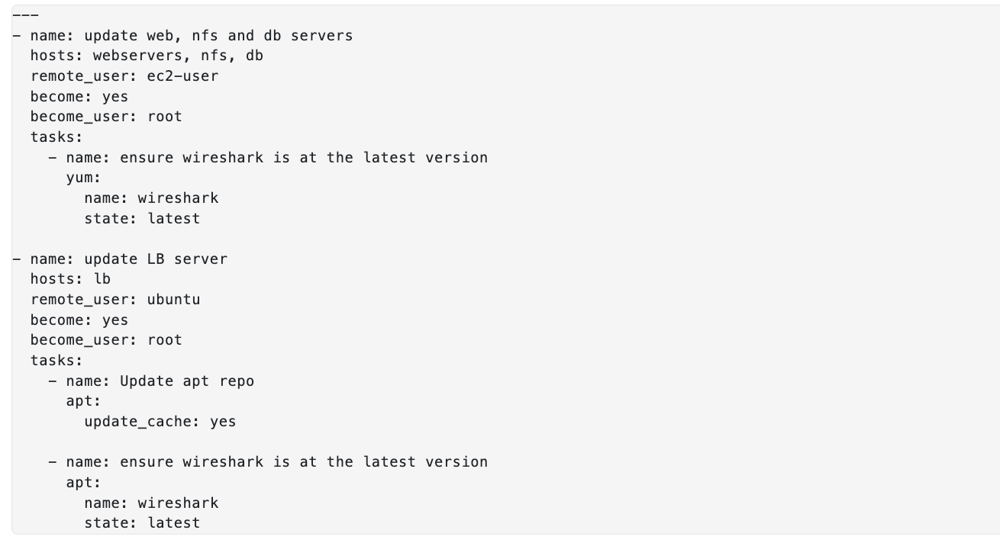

Some sidenotes on yml task files

- start each yml file with three dashes
- name is a short description of the task
- the hosts indicates what hosts the tasks are for. Try to separte tasks for redhat servers from tasks for ubuntu servers
- remote user details with what user you will be accessing the host
- become allows you to become sudo user/root user
- tasks shows a short description of what we want the code to actually do
- under task, you use the correct package manager for the type of instance your host is in.. eg. yum for redhat, apt for ubuntu

Examine the code above and try to make sense out of it. This playbook is divided into two parts, each of them is intended to perform the same task: install wireshark utility (or make sure it is updated to the latest version) on your RHEL 8 and Ubuntu servers. It uses root user to perform this task and respective package manager: `yum `for RHEL 8 and `apt` for Ubuntu.

Feel free to update this playbook with following tasks:

- Create a directory and a file inside it
- Change timezone on all servers
- Run some shell script
…

For a better understanding of Ansible playbooks – watch this video from RedHat (https://youtu.be/ZAdJ7CdN7DY) and read this article(https://www.redhat.com/en/topics/automation/what-is-an-ansible-playbook).

### Step 6 – Update GIT with the latest code

Now all of your directories and files live on your machine and you need to push changes made locally to GitHub.

In the real world, you will be working within a team of other DevOps engineers and developers. It is important to learn how to collaborate with help of `GIT`. In many organisations there is a development rule that do not allow to deploy any code before it has been reviewed by an extra pair of eyes – it is also called "Four eyes principle".

Now you have a separate branch, you will need to know how to raise a `Pull Request (PR)`, get your branch peer reviewed and merged to the master branch.

Commit your code into GitHub:

1. use git commands to add, commit and push your branch to GitHub. Remember you are working on Prj-11 branch and not the main branch

`git status`

`git add <selected files>` or `git add .` for all files 

git commit -m "commit message"

Now push to the prj-11 branch using the code below:

`git push origin prj-11`

2. Create a Pull request (PR)

Upon running the push command, go back to the git repository and you will see this Pull Request pop up:

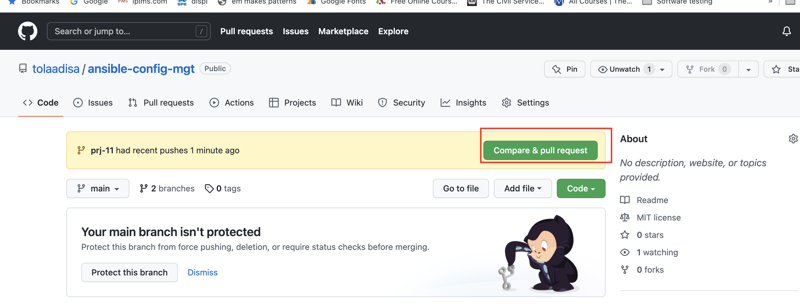

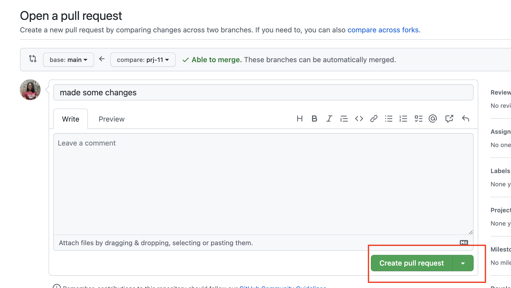

3. Wear a hat of another developer for a second, and act as a reviewer.

4. If the reviewer is happy with your new feature development, merge the code to the master branch.

5. Head back on your terminal, checkout from the feature branch into the master, and pull down the latest changes.

To check out from the prj-11 branch to main branch, use the code below:

`git checkout main`

Once your code changes appear in master branch – Jenkins will do its job and save all the files (build artifacts) to `/var/lib/jenkins/jobs/ansible/builds/<build_number>/archive/` directory on `Jenkins-Ansible` server.

Below shows the snapshot of the artificats on the Jenkins-ansible server:

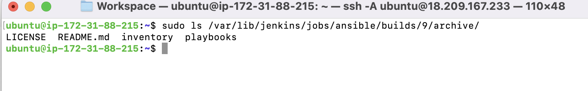

Note that if after you do `git status`, there is a conflict with your main branch and project branch, you can do a `git pull` command to make the two branches alighn with each other. 

## RUN FIRST ANSIBLE TEST

### Step 7 – Run first Ansible test

Now, it is time to execute `ansible-playbook` command and verify if your playbook actually works:

First ensure you are inside the terminal for the remote Jenkins-Ansible server, then run the code below:

Then take note of the build number from jenkins for the latest upload of your common.yml and dev.yml files

then run the `ansible-playbook` code below:

`ansible-playbook -i /var/lib/jenkins/jobs/ansible/builds/11/archive/inventory/dev.yml /var/lib/jenkins/jobs/ansible/builds/11/archive/playbooks/common.yml`

The number `11` indicates the current build number.

The result above shows there was an error connecting to the DB server. 

This is because the db server is an ubuntu server and not a redhat server so the username has to be changed to `ubuntu` and not `ec2-user`

The dev.yml file has to be fixed per below:

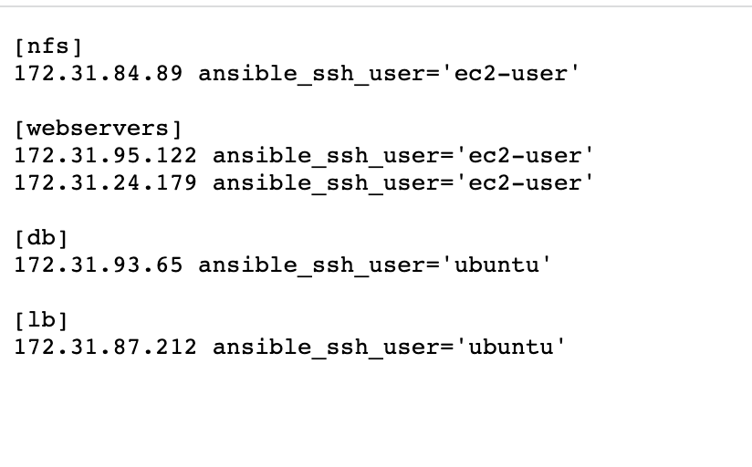

upon running the ansible playbook command again, the result is as follows:

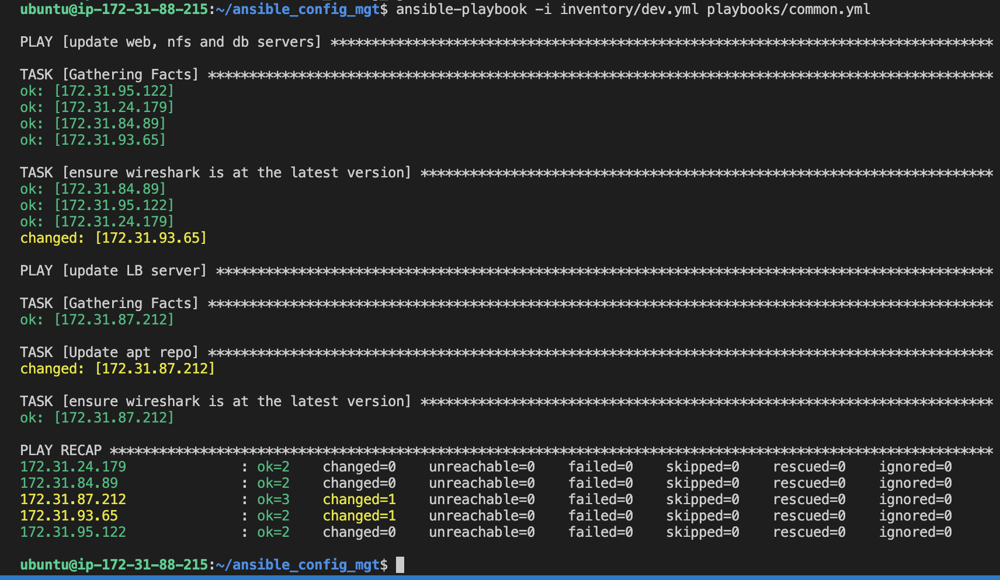

You can go to each of the servers and check if wireshark has been installed by running `which wireshark` or `wireshark --version`

To do this, i will connect to the bastion/jenkins-ansible server and then SSH into a couple of servers (using private IP addresses) from there to check wireshark installation:

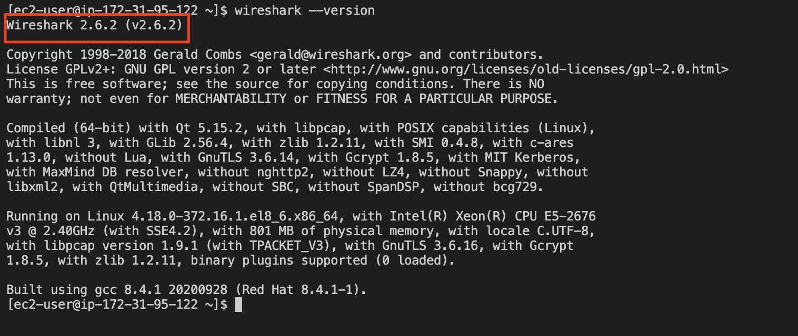

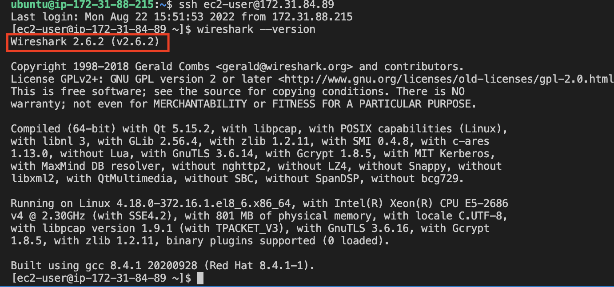

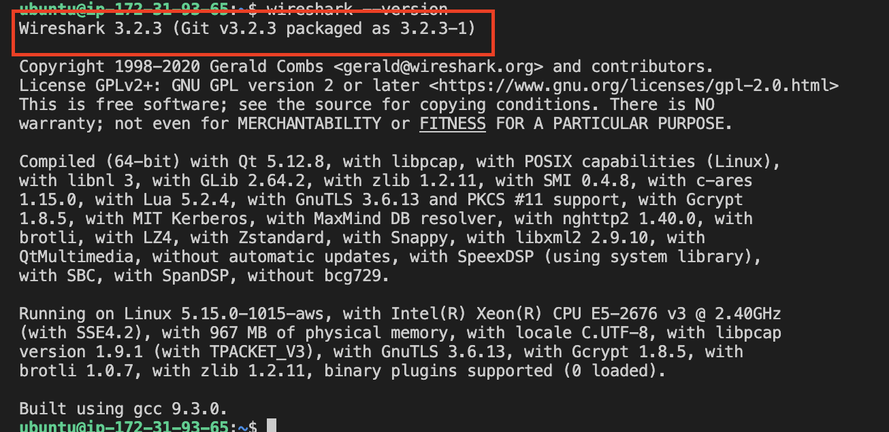

Now that everything is working, the finished architechture is as follows:

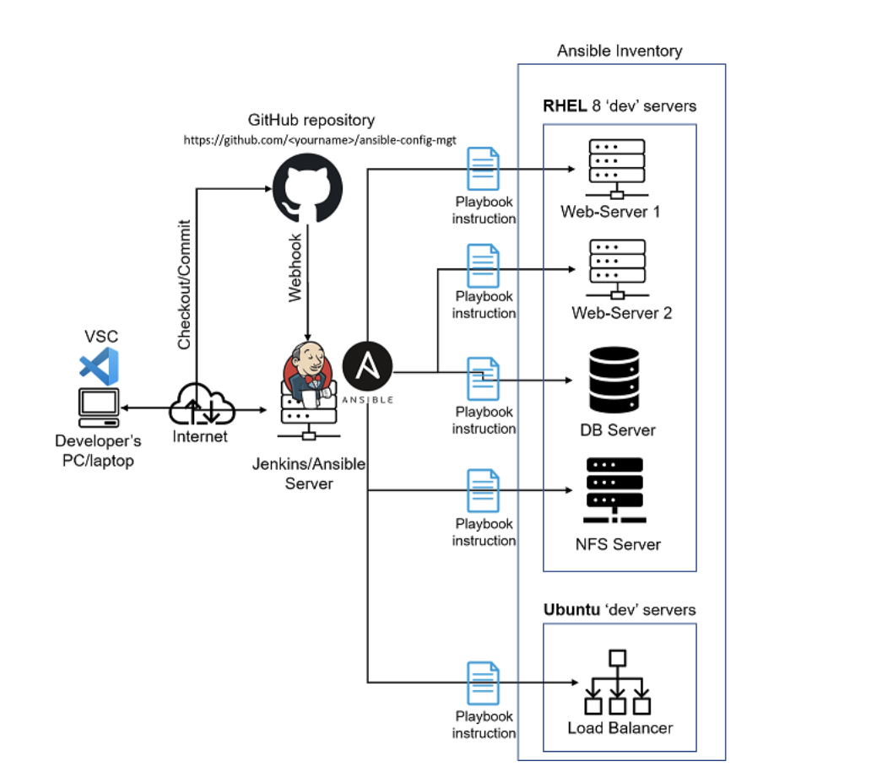

### Optional step – Repeat once again

Update your ansible playbook with some new Ansible tasks and go through the full checkout -> change codes -> commit -> PR -> merge -> build -> ansible-playbook cycle again to see how easily you can manage a servers fleet of any size with just one command!

These changes will be made to the common.yml file so ensure you are checked out to the prj-11 branch to make your changes. 

- Go to the ansible_config_mgmt terminal and check that you are checked out to prj-11 with the code: ` git checkout prj-11`

- Add the following optional bit of code to the `common.yml` file:

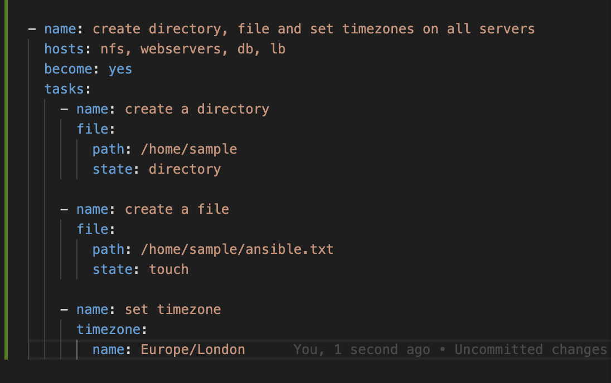

- push the changed code to the github repo and take note of the jenkins build number

- now run the `ansible-playbook` code using the correct build number. I find using the buiild number option is easier to run update code

- The result of the new updates are as follows:

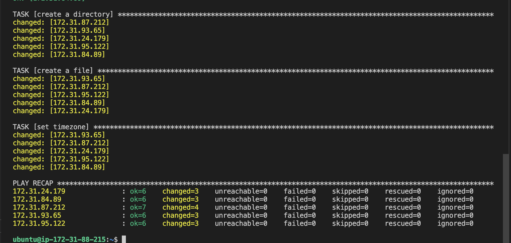

Below shows the result of ssh into the dab server and checking the directory, file and timezone that was created matches what is expected from common.yml file

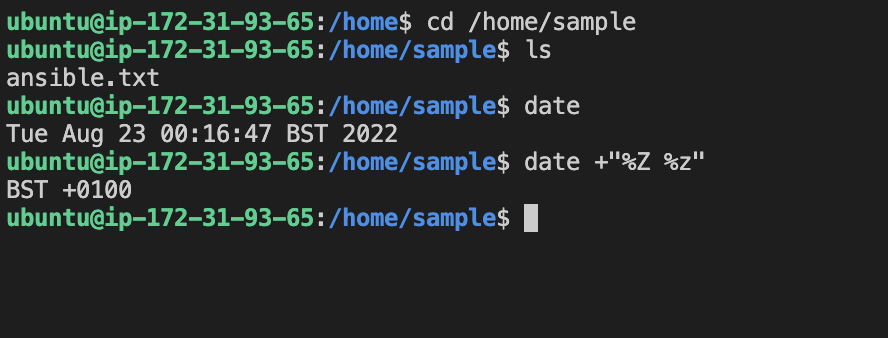

This brings us to the end of project 11

